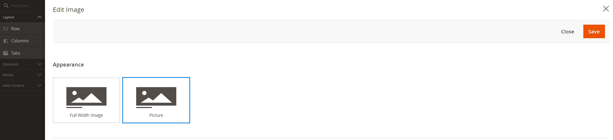

# Page Builder Advanced Image

---

## Image Appearances

Added Image appearance switcher with option to use &lt;picture&gt; instead of using default Magento approach with 2 images swithed by CSS class.



## Installation
To install the module from Packagist, run the following commands:
```sh
composer require nortn/magento2-page-builder-advanced-image-appearance
bin/magento module:enable NortN_PageBuilderImageAppearance
bin/magento setup:upgrade
bin/magento cache:flush
```

## Compatibility
- Magento 2.4.x
- Adobe Commerce (formerly Magento Commerce)

## Support
For any issues or feature requests, please open an issue on GitHub.

GitHub Repository: [m2ext-page-builder-advanced-image-appearance](https://github.com/norton-nimnul/m2ext-page-builder-advanced-image-appearance)
